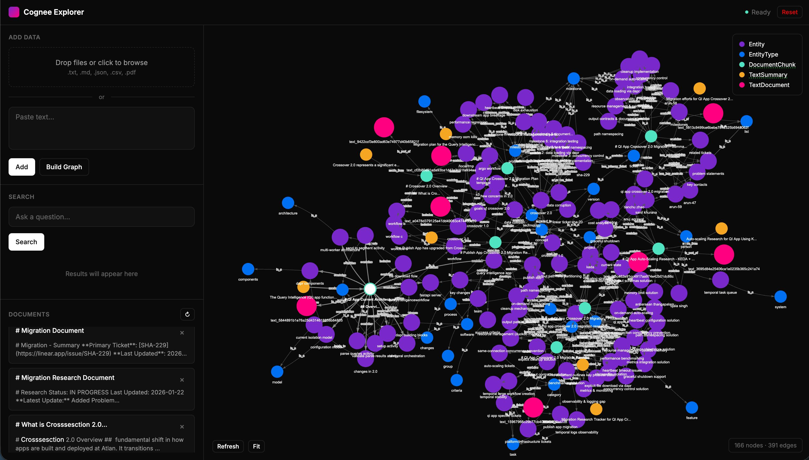

# Cognee Explorer

A web interface for [Cognee](https://github.com/topoteretes/cognee) - an AI memory framework that builds knowledge graphs from unstructured data.



## Features

- **Add Data**: Drop files or paste text to add to the knowledge base
- **Build Graph**: Process data into a searchable knowledge graph
- **Search**: Query your data using natural language
- **Visualize**: Interactive graph visualization with Neo4j
- **Manage**: View and delete individual documents

## Quick Start

### 1. Clone

```bash
git clone https://github.com/vishalx360/cognee-explorer.git
cd cognee-explorer
```

### 2. Configure

```bash
cp .env.example .env
# Edit .env and add your LLM_API_KEY
```

### 3. Run

```bash
docker compose up
```

Open **http://localhost:8000**

## Configuration

Edit `.env` to configure your LLM:

```env
LLM_API_KEY=your-api-key
LLM_MODEL=gpt-4o-mini

# Optional: Use custom API endpoint (OpenAI-compatible)
LLM_API_URL=https://your-llm-proxy.com/v1
```

See `.env.example` for all options.

## Usage

1. **Add Data** - Drag & drop files (.txt, .md, .json, .csv, .pdf) or paste text
2. **Build Graph** - Click "Build Graph" to process into knowledge graph
3. **Search** - Ask questions about your data
4. **View Graph** - Interactive visualization on the right panel
5. **Manage** - Delete documents from the Documents section

## Manual Setup (without Docker)

<details>
<summary>Click to expand</summary>

### Prerequisites
- Python 3.10+
- Neo4j

### Install

```bash
pip install -r requirements.txt
```

### Start Neo4j

```bash
docker run -d --name neo4j -p 7474:7474 -p 7687:7687 \
  -e NEO4J_AUTH=neo4j/password123 neo4j:5-community
```

### Run

```bash
cp .env.example .env
# Edit .env with your settings
python server.py
```

</details>

## API

| Method | Endpoint | Description |
|--------|----------|-------------|
| POST | `/api/add` | Add text to knowledge base |
| POST | `/api/cognify` | Build knowledge graph |
| POST | `/api/search` | Search knowledge base |
| GET | `/api/documents` | List documents |
| DELETE | `/api/documents/{id}` | Delete document |
| POST | `/api/reset` | Reset all data |

## License

MIT

## Credits

Built with [Cognee](https://github.com/topoteretes/cognee)
